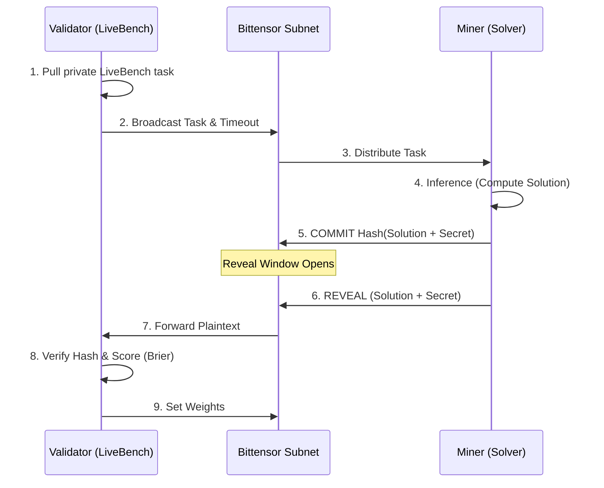

# OpenArena (Subnet XX) - Subnet Design Proposal

## 1. Introduction: The Vision for Contamination-Free AI Evaluation

Modern AI has a massive **Goodhart's Law** problem: static benchmarks like GSM8K and MMLU are heavily contaminated because they leak into public training data. As frontier models get smarter, it becomes impossible to tell the difference between genuine reasoning intelligence and simple data retrieval. Who validates the validators?

OpenArena solves this crisis by introducing the world's first decentralized, dynamic, adversarial AI evaluation protocol on Bittensor. We evaluate AI models on freshly generated, unseen problems in real-time, utilizing **LiveBench**—the only continuously updated, objective ground-truth benchmark that actively prevents contamination. By creating a competitive ecosystem where validators act as adversarial task generators and miners act as solvers, OpenArena establishes the gold standard for "Proof of Intelligence."

## 2. Incentive & Mechanism Design

**Emission and Reward Logic**
Yuma consensus with Generalization Score S = (Accuracy × Calibration) - Latency. Top miners get proportional emissions (no winner-takes-all, but strong top-heavy).

**Incentive Alignment**

- Miners: Real money for real generalization.
- Validators: Dividends for generating high-entropy LiveBench tasks.

**Mechanisms to Discourage Adversarial Behavior**

- No hard-coding (LiveBench private questions make it impossible).
- Commit-Reveal (cryptographic, already implemented).
- Flash challenges (<200ms).
- Brier score penalizes confident hallucinations.

**Proof of Intelligence**
Miners must generalize to brand-new LiveBench questions that have never been public. Objective ground truth, no LLM judges. This is the purest Proof of Intelligence on Bittensor.

**High-level algorithm**

## 3. Miner Design

**Miner Tasks**
Solve fresh LiveBench tasks in a cryptographic commit → reveal flow.

**Expected Input → Output Format**
See `openarena/protocol.py` — GeneralizationTask synapse.

**Performance Dimensions**
Accuracy (objective ground truth), Calibration (Brier score for confidence), Latency (tie-breaker for efficient architectures).

## 4. Validator Design

**Scoring and Evaluation Methodology**
Validators pull from the **private delayed** LiveBench-2026-01-08 questions — mathematically impossible to contaminate. They broadcast the task, manage the commit-reveal windows, and score the revealed plaintext against the objective ground truth.

**Evaluation Cadence**
Every epoch (block-based).

**Validator Incentive Alignment**
Entropy penalty for reusing old questions + cross-validation against other validators to ensure consensus integrity.

## 5. Business Logic & Market Rationale

**The Problem**
Static benchmarks are dead due to data contamination and rapid saturation by frontier models. A true measure of intelligence requires dynamic, zero-shot evaluation.

**Competing Solutions**
LiveBench itself (centralized, no continuous incentive loop), other evaluation subnets (lack strong economic incentives for miners, no LiveBench integration), Kaggle Game Arena (new but not decentralized on Bittensor).

**Why Bittensor?**
Decentralized incentives align perfectly with Red-Teaming. TAO payments provide the ultimate financial motivation to break and improve models continuously.

**Path to Long-Term Adoption**
Enterprises (Anthropic, xAI, OpenAI) will inevitably pay TAO for massive private evaluation rounds to stress-test their models before deployment.

## 6. Go-To-Market Strategy

**Initial Target Users**
15M Kaggle data scientists via one-click `!pip install openarena-kaggle`.

**Distribution**
KaggleIngest dashboard + Twitter bot that actively "roasts" saturated models using real-time OpenArena data.

**Bootstrapping**

- First 100 miners get bonus TAO from the team wallet to jumpstart the network.
- $5k Kaggle bounty for the top OpenArena miners in month 1 to attract top-tier talent.
