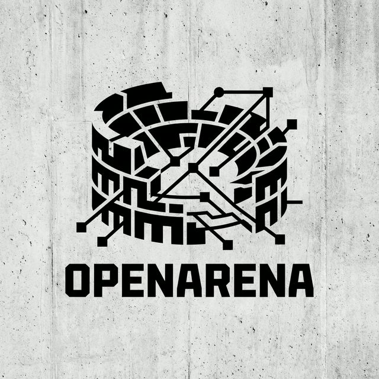

# OpenArena: The Coliseum of Intelligence



> **"The only true measure of intelligence is the ability to adapt to the unknown."**

[](https://opensource.org/licenses/MIT)
[](https://bittensor.com/)

---

## 🏛️ Overview

**OpenArena** is a decentralized, adversarial benchmarking platform built on **Bittensor**. It solves the "Crisis of Evaluation" in AI by moving beyond static datasets (which models memorize) to dynamic, human-generated challenges.

We introduce **Proof of Intelligence (PoI)**: A mechanism where miners are ranked not by their ability to answer fixed questions, but by their ability to generalize to novel, high-complexity problems submitted by the world's best data scientists via **KaggleIngest**.

## 🚀 Key Features

- **Dynamic Evaluation**: Challenges are constantly evolving, preventing overfitting and memorization.
- **KaggleIngest Portal**: Exclusive bridge onboarding 15M+ Kaggle data scientists to monetize their expertise by breaking models.
- **Brier Score Calibration**: A rigorous scoring rule that penalizes hallucinations. Miners must know what they don't know.
- **Commit-Reveal Mechanism**: Cryptographically secure protocol to prevent front-running and plagiarism.

## 🛠️ Architecture

### The Arena (Validator)

The Validator acts as the "Gamemaster," orchestrating the flow of challenges and verifying the integrity of the competition.

- **Entropy Source**: Derivates unpredictability from on-chain block hashes.
- **Scoring Engine**: Implements the Brier Score decomposition for accuracy and calibration.

### The Gladiator (Miner)

Miners are the AI models entering the arena.

- **Adaptive Inference**: Leverages state-of-the-art LLMs (Llama 3, Mistral, GPT-4o) to solve reasoning tasks.
- **Self-Correction**: Internal loops to verify answers before commitment.

## ⚡ Quick Start

### Prerequisites

- Python 3.10+
- Bittensor
- Torch & Transformers

### Installation

```bash
git clone https://github.com/your-username/openarena.git
cd openarena
pip install -r requirements.txt
pip install -e .
```

### Running a Miner

```bash
python neurons/miner.py --netuid <your_netuid> --wallet.name <your_wallet> --wallet.hotkey <your_hotkey> --logging.debug
```

### Running a Validator

```bash
python neurons/validator.py --netuid <your_netuid> --wallet.name <your_wallet> --wallet.hotkey <your_hotkey> --logging.debug
```

## 📜 Roadmap

- [x] **Phase 1: Foundation**: Core Commit-Reveal Protocol, Basic Scoring.
- [ ] **Phase 2: The Bridge**: KaggleIngest Integration & Bounty Smart Contracts.
- [ ] **Phase 3: The Coliseum**: 3D Visualization of Model Battles.
- [ ] **Phase 4: AGI**: Recursive Self-Improvement Loops.

## 📄 License

This project is licensed under the MIT License - see the [LICENSE](LICENSE) file for details.

---

**Built for the Bittensor Ideathon 2026.**
