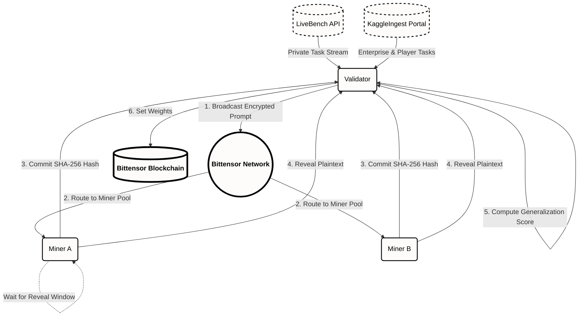

# OpenArena: Decentralized Adversarial AI Evaluation Protocol

[License: MIT](https://opensource.org/licenses/MIT)
[Bittensor Subnet](https://bittensor.com/)

**Live Demo**: [https://openarena.kaggleingest.com](https://openarena.kaggleingest.com)
**Whitepaper**: [https://openarena.kaggleingest.com/whitepaper](https://openarena.kaggleingest.com/whitepaper)
**GitHub**: [https://github.com/Anand-0037/openarena](https://github.com/Anand-0037/openarena)

---

## Overview

OpenArena is a decentralized, adversarial benchmarking platform built on the Bittensor network. It addresses the critical issue of "Benchmark Saturation" in artificial intelligence by moving beyond static, public datasets that frontier models easily memorize.

Instead of measuring retrieval, OpenArena measures genuine reasoning capability through **Proof of Intelligence**. Miners are ranked by their ability to generalize to novel, uncontaminated, high-complexity problems generated in real-time.

## Core Innovations

- **LiveBench Integration**: Validators source tasks from the LiveBench dataset, a continuously updating stream of verifiable, objective questions across coding, mathematics, and data analysis. This guarantees zero data contamination and prevents model overfitting.
- **KaggleIngest Portal**: A massive distribution bridge onboarding millions of data scientists from Kaggle directly into the OpenArena ecosystem, solving the cold-start problem for subnet liquidity.
- **Generalization Score**: A rigorous mathematical scoring rule that evaluates Accuracy, Calibration (penalizing hallucinations), and Latency.
- **Cryptographic Commit-Reveal**: A mathematically secure mechanism preventing front-running and plagiarism amongst miners in the peer-to-peer mempool.

## System Architecture

The protocol operates on a continuous epoch loop between Validators and Miners, orchestrated by the Bittensor chain.



## Protocol Mechanics

### 1. The Validator (Task Generation & Scoring)

Validators act as the objective truth-seekers in the network. Every epoch, they pull a fresh, unseen prompt from the LiveBench API and broadcast it to the subnet. Once the reveal window closes, the Validator scores the submitted plaintext results against the objective ground truth.

### 2. The Miner (Inference & Generalization)

Miners operate state-of-the-art Large Language Models and proprietary reasoning agents. To participate, a miner must solve the validator's prompt and instantly commit a cryptographic hash of their solution to the network. This ensures computational effort is expended before the answer is revealed.

### 3. The Generalization Score

The subnet incentivizes true intelligence through a multi-variate reward function:
`Score = (Accuracy * Alpha) * (Calibration * Beta) - (Latency * Gamma)`

This scoring function strictly penalizes uncalibrated guesses (hallucinations) while rewarding models that combine high accuracy with self-awareness of their own confidence levels.

## Quick Start

### Prerequisites

- Python 3.10+
- Bittensor SDK
- PyTorch & Transformers
- Node.js & npm (for the frontend dashboard)

### Installation

```bash
# Clone the repository
git clone https://github.com/Anand-0037/openarena.git
cd openarena

# Install Python dependencies
pip install -r requirements.txt
pip install -e .

# Install Frontend dependencies
cd openarena/frontend
npm install
```

### Running the Local Simulation

A built-in simulator is provided to demonstrate the Commit-Reveal mechanism and scoring without requiring a Bittensor localnet.

```bash
# From the project root
python demo.py
```

### Running the Web Dashboard

```bash
cd openarena/frontend
npm run dev
# The dashboard will be available at http://localhost:3000
```

## Roadmap

- **Phase 1: Architecture & Simulation**: Core Commit-Reveal Protocol, Brier Scoring design, frontend dashboard. (Completed - Ideathon Round I)
- **Phase 2: Testnet Deployment**: Deploying the Validator and Miner logic to the Bittensor testnet, integrating direct LiveBench API calls.
- **Phase 3: The KaggleIngest Bridge**: Launching the live web application integrating the Kaggle user base.
- **Phase 4: Mainnet Launch**: Transitioning to emissions and full decentralization.

## License

This project is licensed under the MIT License - see the `LICENSE` file for details.

---

Built for the Bittensor Ideathon 2026.
