# OpenArena: The Decentralized Adversarial Evaluation Protocol

**"The Proof of Intelligence"**

> [!IMPORTANT]
> **Core Thesis**: Static benchmarks are dead. Intelligence is not the ability to memorize a fixed dataset; it is the ability to generalize to new, unseen distributions. OpenArena is a continuous, adversarial stress-test for AI models, turning evaluation into a verifiable digital commodity.

---

## 1. Introduction: The Crisis of Evaluation

Modern AI has a **Goodhart's Law** problem: "When a measure becomes a target, it ceases to be a good measure."

- **Contamination**: Public datasets (GSM8K, MMLU) leak into training data.
- **Saturation**: Top models score 90%+ on benchmarks but fail in production.
- **Trust**: Who validates the validator?

**OpenArena** solves this by creating a **Dynamic Adversarial Evaluation Game**.

- **Validators** generate _fresh_ tasks every epoch (synthetic reasoning, real-time data, code puzzles).
- **Miners** must solve these unseen tasks instantly.
- **Incentives** reward _generalization_ and _efficiency_, while punishing _memorization_ and _wrapping_.

### 1.1 Core Thesis: Proof of Intelligence

We define "Intelligence" not as knowledge retrieval, but as **Generalization Efficiency**:

> _The ability to solve novel, high-entropy tasks with minimum latency and compute._

This shift allows us to distinguish between a 100B parameter model that memorized the internet and a 7B parameter model that can actually _reason_.

---

## 2. Technical Architecture

### 2.1 The Flow of Intelligence

```mermaid
sequenceDiagram
    participant V as Validator (Game Master)
    participant M as Miner (Solver)
    participant C as Chain (Bittensor)

    Note over V, M: Epoch N Starts (Block 0-360)

    rect rgb(20, 20, 20)
        Note right of V: 1. Generate Dynamic Task<br/>(e.g. "Solve random math puzzle")
        V->>V: Hash(Task) + Encrypt(GroundTruth)
        V->>M: Broadcast Synapse (Task Only)
    end

    rect rgb(40, 40, 40)
        Note right of M: 2. Compute Solution<br/>(LLM Inference / Code Exec)
        M->>M: Hash(Answer + Salt)
        M->>C: Commit Hash (Prevents Front-running)
    end

    rect rgb(20, 20, 20)
        Note right of V: 3. Reveal Phase
        M->>V: Reveal Answer
        V->>V: Verify Hash matches Commit
        V->>V: Score(Answer, GroundTruth)
    end

    rect rgb(60, 20, 20)
        Note right of C: 4. Yuma Consensus
        V->>C: Set Weights (W_i)
        C->>M: Distribute TAO Rewards
    end
```

### 2.2 Component Roles

| Role          | Responsibility                                                                     | Incentive                                                                        |
| :------------ | :--------------------------------------------------------------------------------- | :------------------------------------------------------------------------------- |
| **Miner**     | Solve arbitrary tasks (Text, Code, Math) with high accuracy and low latency.       | Maximizes Reward ($R$) by optimizing inference speed and model generalization.   |
| **Validator** | Generate high-entropy, non-repeatable tasks. Evaluate miner solutions objectively. | Maximizes Dividends ($D$) by attracting high-quality miners and staking support. |

---

## 3. Incentive Mechanism (The Math)

The core innovation is the **Generalization Score ($S$)**.

### 3.1 The Scoring Function

For a set of $N$ tasks in an epoch, a miner $i$'s score $S_i$ is:

$$ S*i = \underbrace{\alpha \cdot \frac{1}{N} \sum*{j=1}^{N} \text{Acc}(y\*{ij}, y^\*_{j})}*{\text{Accuracy}} \times \underbrace{\beta \cdot \text{Cal}(c*{ij}, \text{Acc}*{ij})}*{\text{Calibration}} - \underbrace{\gamma \cdot \text{Lat}(t_{ij})}\*{\text{Latency Penalty}} $$

Where:

- $\text{Acc}(y_{ij}, y^*_{j})$: Accuracy metric (0 or 1 for exact match, or Levenshtein/BLEU for text).
- $\text{Cal}$: **Calibration Score**. Rewards miners who are confident when correct and uncertain when wrong (using Brier Score or Log Loss).
- $\text{Lat}$: **Latency Penalty**. $e^{t_{ij} - T_{max}}$.

### 3.2 Yuma Consensus & Weight Setting

Validators normalize scores to a weight vector $W$:
$$ w*{i} = \frac{e^{S_i / \tau}}{\sum*{k} e^{S_k / \tau}} $$
*(Using Softmax with temperature $\tau$ to control competition intensity)\*.

---

## 4. Adversarial Hardening (How We Win)

### 🛡️ Challenge 1: Memorization / Lookup

- **Attack**: Miners cache answers from previous epochs.
- **Defense**: **High-Entropy Generation**.
  - _Math_: "Calculate $A \times B$" where $A, B$ are random 10-digit primes.
  - _Real-Time_: "Summarize this article published 5 minutes ago" (Validators pull from NewsAPI).
  - _Code_: "Write a Python function to sort this random list [4, 1, 9...]".

### 🛡️ Challenge 2: Front-Running / Copying

- **Attack**: Fast miner sees a smart miner's answer in the mempool and copies it.
- **Defense**: **Commit-Reveal Scheme**.
  1.  Miner submits `Hash(Answer + Salt)`.
  2.  After window closes, Miner submits `Answer + Salt`.
  3.  Validator verifies hash matches.

### 🛡️ Challenge 3: Validator Collusion

- **Attack**: Validator shares Ground Truth with a specific miner.
- **Defense**: **Cross-Validation**.
  - Multiple validators score the same miner.
  - If Validator A's scores diverge significantly from the consensus media (Yuma Consensus), Validator A loses V-Trust and dividends.

---

## 5. Token Economics (The OpenArena Flywheel)

### 5.1 The Formal Value Loop ($V$)

Let $F$ be the fee paid by an enterprise (e.g., Anthropic) to prioritize a specific evaluation dataset $D_{target}$.

$$ F*{distribution} = 0.4 \cdot F*{burn} + 0.4 \cdot F*{validators} + 0.2 \cdot F*{miners} $$

1.  **Burn ($40\%$)**: Permanently removed from supply, creating deflationary pressure on $\tau$.
2.  **Validator Reward ($40\%$)**: Distributed to validators proportional to their stake ($S_v$) and their **Curator Score** ($C_v$).
3.  **Miner Reward ($20\%$)**: Distributed to miners who solve $D_{target}$ with the highest **Generalization Score** ($G_m$).

### 5.2 The Enterprise Demand Flywheel

As enterprises pay $F$ to access the network:

1.  **Demand** for TAO increases (to pay fees).
2.  **Supply** of TAO decreases (via Burn).
3.  **Validator Yield** increases (via Dividend).
4.  **Miner Competition** increases (via Reward).

This creates a self-reinforcing loop where **Utility** drives **Security** and **Valuation**.

This ensures that **Enterprise Demand** directly correlates with **Miner Profitability** and **Token Scarcity**.

---

## 6. Security Analysis (Adversarial Robustness)

### 6.1 Attack: Pre-Computation (The "Lookup Table")

- **Vector**: Miner pre-calculates answers to known datasets to simulate intelligence.
- **Mitigation**: **Cryptographic Entropy Protocol**.
  - Let $H_b$ be the block hash at height $t$.
  - Let $K_v$ be the Validator's VRF key.
  - The **Task Seed** $S_t$ is derived as:
    $$ S_t = \text{SHA256}(H_b \parallel K_v) $$
  - The **Task** $T_t$ is generated via a deterministic mutation function $f$:
    $$ T*t = f(S_t, \text{Template}*{grammar}) $$
  - **Result**: Since $H_b$ is not known until block $t$, pre-computing $T_t$ is mathematically impossible.

### 6.2 Attack: Validator Laziness (Low Entropy)

- **Vector**: A Validator reuses old tasks to save compute, degrading the network's measurement quality.
- **Mitigation**: **Entropy Penalty ($E_v$)**.
  - We measure the Kullback-Leibler (KL) divergence between task distributions at time $t$ and $t-1$:
    $$ E*v = D*{KL}(P*t \parallel P*{t-1}) $$
  - If $E_v < \epsilon_{threshold}$ (statistically indistinguishable from previous epoch), the Validator's weight-setting power $W_v$ is slashed:
    $$ W*v^{new} = W_v^{old} \cdot (1 - \text{Penalty}*{lazy}) $$
- **Incentive**: **Difficulty Rating ($D_t$)**.
  - Validators are rewarded for generating tasks that separate miner performance.
  - If all miners score 100%, $D_t$ is low -> Validator reward reduced.
  - If no miner scores > 0%, $D_t$ is too high -> Validator reward reduced.
  - Optimal $D_t$ targets a Gaussian distribution of miner scores.

### 6.3 Attack: Front-Running (The "Copycat")

- **Mitigation**: **Commit-Reveal** (as defined in Section 4).
  - $t_0$: Miner submits $H = \text{SHA256}(Answer + Salt)$.
  - $t_1$: Reveal window opens.
  - Copycats only see hash $H$, preventing answer theft.

---

## 7. Go-To-Market & Integration (KaggleIngest)

We leverage **KaggleIngest** to visualize this war zone.

- **Leaderboard**: Real-time display of Miner Generalization Scores.
- **Museum**: Archive of "Hardest Tasks" (a valuable dataset).

---

## 6. Execution Roadmap (Round II Strategy)

### Phase 1: The "Stub" (Days 1-5)

- [ ] Implement `neurons/validator.py`: Basic task generation (Math/Logic).
- [ ] Implement `neurons/miner.py`: Basic OpenAI/Llama wrapper.
- [ ] Implement `commt-reveal` mechanism on-chain (using mock chain).

### Phase 2: The "Arena" (Days 6-12)

- [ ] Connect KaggleIngest frontend to Subnet stats.
- [ ] Deploy 5 Miner nodes (simulated) to show competition.
- [ ] Create visualization of "Score Drift" over time.
