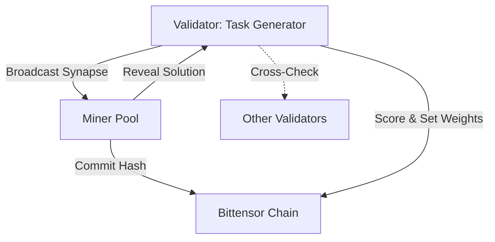

# How to Win the Bittensor Subnet Ideathon: OpenArena Strategy

> [!IMPORTANT]
> **Pivot Alert**: We have shifted from "Green AI" to **OpenArena: The Decentralized Adversarial Evaluation Protocol**. This leverages your Kaggle background to solve AI's "Benchmark Saturation" crisis.

## 🚀 The Winning Concept: OpenArena

**Tagline**: _The World’s First Decentralized, Adversarial AI Evaluation Protocol._

### 1. The Problem Space

- **Benchmark Saturation**: GPT-4o effectively "memorizes" static datasets like GSM8K. We can no longer distinguish _intelligence_ from _retrieval_.
- **Data Contamination**: Public evaluation data leaks into training sets.
- **Trust**: Who validates the validator?

### 2. The Solution: Dynamic Adversarial Evaluation

OpenArena is a subnet where:

1.  **Validators** act as "Game Masters," generating _fresh_ tasks every epoch (math puzzles, real-time news summarization, code challenges).
2.  **Miners** act as "Solvers," competing to generalize to these unseen tasks instantly.
3.  **Incentives** reward **Generalization** (adaptive intelligence) and penalize **Memorization** (overfitting).

### 3. Mechanism Design (The "Heart")

Our core innovation is the **Generalization Score ($S$)**:

$$ S*i = \underbrace{\alpha \cdot \text{Accuracy}}*{\text{Correctness}} \times \underbrace{\beta \cdot \text{Calibration}}_{\text{Confidence}} - \underbrace{\gamma \cdot \text{Latency}}_{\text{Speed}} $$

- **Anti-Gaming**: We use a **Commit-Reveal** scheme to prevent miners from copying answers from the mempool.
- **Validator Consensus**: Yuma Consensus ensures no single validator controls the ground truth.

---

## 🏗️ Technical Architecture

### High-Level Flow

---

## 📄 Submission Components (Round I)

### 1. The Whitepaper (PDF)

- **Thesis**: "Proof of Intelligence is the ability to generalize, not memorize."
- **Math**: Detailed incentive function covering accuracy, calibration, and latency.
- **Adversarial Analysis**: How we prevent Sybil attacks and collusion.

### 2. The Pitch Deck (Business Case)

- **Market**: "The $10B Data Labeling & Evaluation Market."
- **Narrative**: OpenArena creates the "Gold Standard" for AI capability tracking.
- **Integration**: Leverage **KaggleIngest** as the frontend for real-time visualization.

### 3. The Video (5 Minutes)

- **Show**: Validator generating a math puzzle -> Miner solving it -> Score updating on-chain.
- **Tell**: "We are measuring _real_ intelligence, for the first time."

---

## 🛠️ Execution Strategy (Round II)

- **Phase 1**: Build a "Stub" subnet with simulated miners.
- **Phase 2**: Implement the Commit-Reveal mechanism on a local testnet.
- **Phase 3**: Connect KaggleIngest to show live "Generalization Leaderboards."
